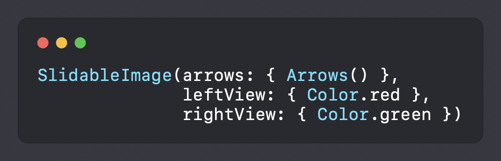

# SlidableImage

[]()
[](https://swift.org/package-manager)

Easy to use library for before & after images. One-line initialization and SwiftUI.

## Requirements

- iOS 15
- Swift 5

## Instalation

This library support

- Swift Package Manager

## Using



### Constructor 

```swfit 
init(@ViewBuilder arrows: @escaping () -> ArrowsIcon,
     @ViewBuilder leftView: @escaping () -> LeftView,
     @ViewBuilder rightView: @escaping () -> RightView)
```

### Arrows

```swift
init(arrowColor: Color = .white, backgroundColor: Color = .gray)
```

## Author

Paweł Bednorz, Quver

## License

SlidableImage Lib and Slider graphic are available under the MIT license. 
Check the LICENSE file for more information.
